# OCEAN Sequence Flow Diagrams

This document contains detailed sequence diagrams for the OCEAN CXL Emulation Framework.

---

## Table of Contents

1. [System Initialization](#1-system-initialization)
2. [Memory Operations](#2-memory-operations)
3. [Coherency Protocol](#3-coherency-protocol)
4. [Data Migration](#4-data-migration)
5. [Multi-Host Scenarios](#5-multi-host-scenarios)
6. [Communication Flows](#6-communication-flows)

---

## 1. System Initialization

### 1.1 Server Startup Sequence

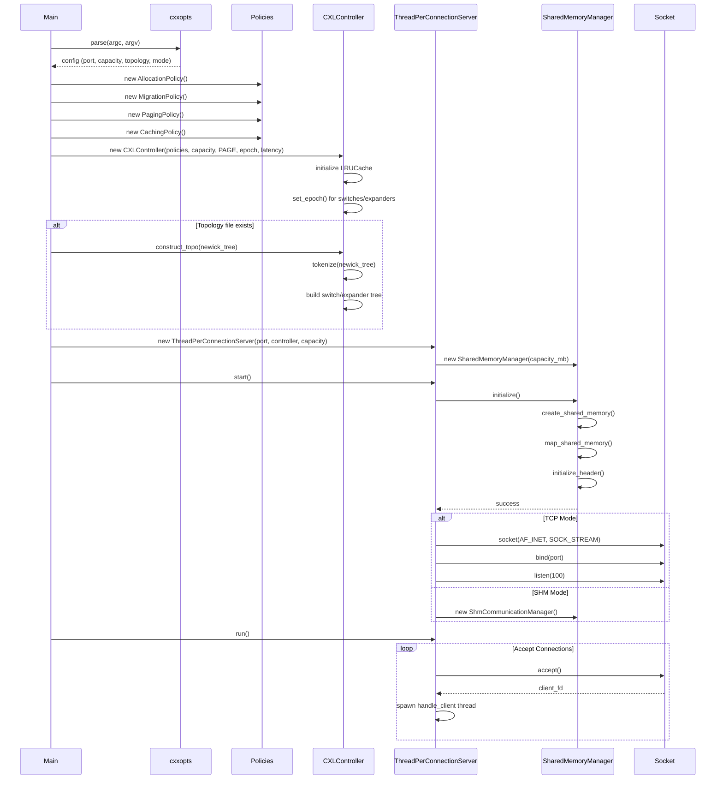
```mermaid
sequenceDiagram
    participant Main
    participant Options as cxxopts
    participant Policies
    participant Controller as CXLController
    participant Server as ThreadPerConnectionServer
    participant SHM as SharedMemoryManager
    participant Socket

    Main->>Options: parse(argc, argv)
    Options-->>Main: config (port, capacity, topology, mode)
    
    Main->>Policies: new AllocationPolicy()
    Main->>Policies: new MigrationPolicy()
    Main->>Policies: new PagingPolicy()
    Main->>Policies: new CachingPolicy()
    
    Main->>Controller: new CXLController(policies, capacity, PAGE, epoch, latency)
    Controller->>Controller: initialize LRUCache
    Controller->>Controller: set_epoch() for switches/expanders
    
    alt Topology file exists
        Main->>Controller: construct_topo(newick_tree)
        Controller->>Controller: tokenize(newick_tree)
        Controller->>Controller: build switch/expander tree
    end
    
    Main->>Server: new ThreadPerConnectionServer(port, controller, capacity)
    Server->>SHM: new SharedMemoryManager(capacity_mb)
    
    Main->>Server: start()
    Server->>SHM: initialize()
    SHM->>SHM: create_shared_memory()
    SHM->>SHM: map_shared_memory()
    SHM->>SHM: initialize_header()
    SHM-->>Server: success
    
    alt TCP Mode
        Server->>Socket: socket(AF_INET, SOCK_STREAM)
        Server->>Socket: bind(port)
        Server->>Socket: listen(100)
    else SHM Mode
        Server->>SHM: new ShmCommunicationManager()
    end
    
    Main->>Server: run()
    
    loop Accept Connections
        Server->>Socket: accept()
        Socket-->>Server: client_fd
        Server->>Server: spawn handle_client thread
    end
```

### 1.2 Client Connection Sequence

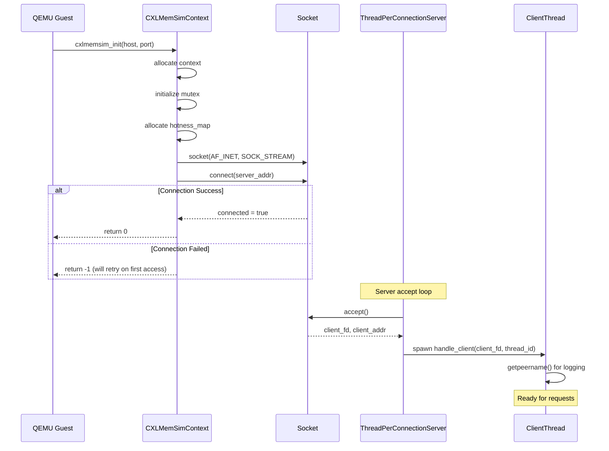
```mermaid
sequenceDiagram
    participant QEMU as QEMU Guest
    participant Client as CXLMemSimContext
    participant Socket
    participant Server as ThreadPerConnectionServer
    participant Thread as ClientThread

    QEMU->>Client: cxlmemsim_init(host, port)
    Client->>Client: allocate context
    Client->>Client: initialize mutex
    Client->>Client: allocate hotness_map
    
    Client->>Socket: socket(AF_INET, SOCK_STREAM)
    Client->>Socket: connect(server_addr)
    
    alt Connection Success
        Socket-->>Client: connected = true
        Client-->>QEMU: return 0
    else Connection Failed
        Client-->>QEMU: return -1 (will retry on first access)
    end
    
    Note over Server: Server accept loop
    Server->>Socket: accept()
    Socket-->>Server: client_fd, client_addr
    
    Server->>Thread: spawn handle_client(client_fd, thread_id)
    Thread->>Thread: getpeername() for logging
    
    Note over Thread: Ready for requests
```

---

## 2. Memory Operations

### 2.1 CXL Type-3 Read Operation

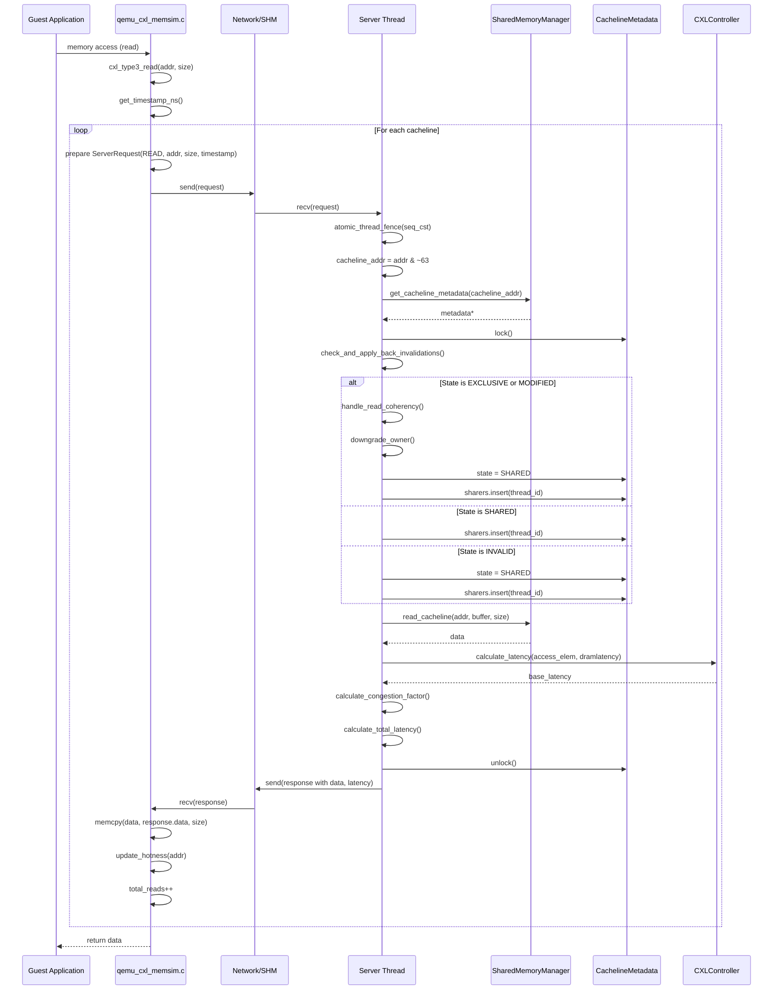
```mermaid
sequenceDiagram
    participant App as Guest Application
    participant QEMU as qemu_cxl_memsim.c
    participant Net as Network/SHM
    participant Server as Server Thread
    participant SHM as SharedMemoryManager
    participant Meta as CachelineMetadata
    participant Ctrl as CXLController

    App->>QEMU: memory access (read)
    QEMU->>QEMU: cxl_type3_read(addr, size)
    QEMU->>QEMU: get_timestamp_ns()
    
    loop For each cacheline
        QEMU->>QEMU: prepare ServerRequest(READ, addr, size, timestamp)
        QEMU->>Net: send(request)
        Net->>Server: recv(request)
        
        Server->>Server: atomic_thread_fence(seq_cst)
        Server->>Server: cacheline_addr = addr & ~63
        
        Server->>SHM: get_cacheline_metadata(cacheline_addr)
        SHM-->>Server: metadata*
        
        Server->>Meta: lock()
        
        Server->>Server: check_and_apply_back_invalidations()
        
        alt State is EXCLUSIVE or MODIFIED
            Server->>Server: handle_read_coherency()
            Server->>Server: downgrade_owner()
            Server->>Meta: state = SHARED
            Server->>Meta: sharers.insert(thread_id)
        else State is SHARED
            Server->>Meta: sharers.insert(thread_id)
        else State is INVALID
            Server->>Meta: state = SHARED
            Server->>Meta: sharers.insert(thread_id)
        end
        
        Server->>SHM: read_cacheline(addr, buffer, size)
        SHM-->>Server: data
        
        Server->>Ctrl: calculate_latency(access_elem, dramlatency)
        Ctrl-->>Server: base_latency
        
        Server->>Server: calculate_congestion_factor()
        Server->>Server: calculate_total_latency()
        
        Server->>Meta: unlock()
        
        Server->>Net: send(response with data, latency)
        Net->>QEMU: recv(response)
        
        QEMU->>QEMU: memcpy(data, response.data, size)
        QEMU->>QEMU: update_hotness(addr)
        QEMU->>QEMU: total_reads++
    end
    
    QEMU-->>App: return data
```

### 2.2 CXL Type-3 Write Operation

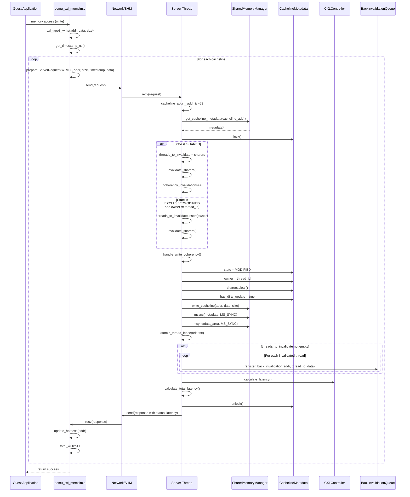
```mermaid
sequenceDiagram
    participant App as Guest Application
    participant QEMU as qemu_cxl_memsim.c
    participant Net as Network/SHM
    participant Server as Server Thread
    participant SHM as SharedMemoryManager
    participant Meta as CachelineMetadata
    participant Ctrl as CXLController
    participant BackInv as BackInvalidationQueue

    App->>QEMU: memory access (write)
    QEMU->>QEMU: cxl_type3_write(addr, data, size)
    QEMU->>QEMU: get_timestamp_ns()
    
    loop For each cacheline
        QEMU->>QEMU: prepare ServerRequest(WRITE, addr, size, timestamp, data)
        QEMU->>Net: send(request)
        Net->>Server: recv(request)
        
        Server->>Server: cacheline_addr = addr & ~63
        
        Server->>SHM: get_cacheline_metadata(cacheline_addr)
        SHM-->>Server: metadata*
        
        Server->>Meta: lock()
        
        alt State is SHARED
            Server->>Server: threads_to_invalidate = sharers
            Server->>Server: invalidate_sharers()
            Server->>Server: coherency_invalidations++
        else State is EXCLUSIVE/MODIFIED and owner != thread_id
            Server->>Server: threads_to_invalidate.insert(owner)
            Server->>Server: invalidate_sharers()
        end
        
        Server->>Server: handle_write_coherency()
        Server->>Meta: state = MODIFIED
        Server->>Meta: owner = thread_id
        Server->>Meta: sharers.clear()
        Server->>Meta: has_dirty_update = true
        
        Server->>SHM: write_cacheline(addr, data, size)
        
        Server->>SHM: msync(metadata, MS_SYNC)
        Server->>SHM: msync(data_area, MS_SYNC)
        Server->>Server: atomic_thread_fence(release)
        
        alt threads_to_invalidate not empty
            loop For each invalidated thread
                Server->>BackInv: register_back_invalidation(addr, thread_id, data)
            end
        end
        
        Server->>Ctrl: calculate_latency()
        Server->>Server: calculate_total_latency()
        
        Server->>Meta: unlock()
        
        Server->>Net: send(response with status, latency)
        Net->>QEMU: recv(response)
        
        QEMU->>QEMU: update_hotness(addr)
        QEMU->>QEMU: total_writes++
    end
    
    QEMU-->>App: return success
```

### 2.3 Controller Insert Operation

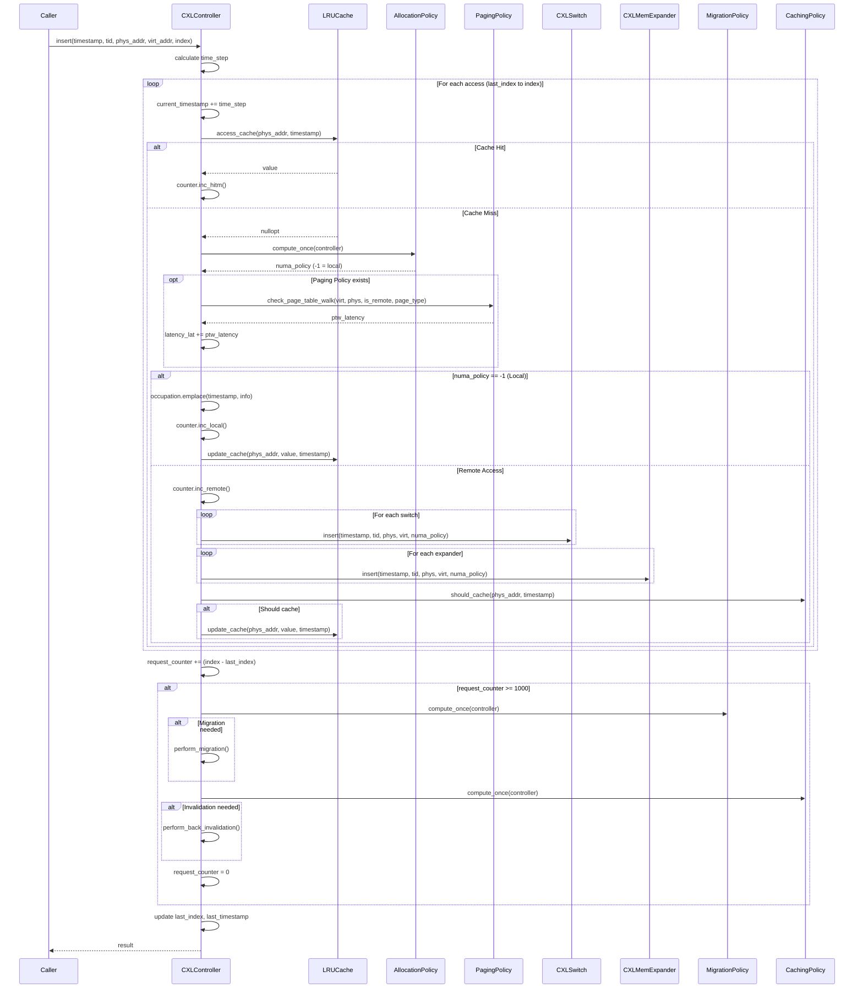
```mermaid
sequenceDiagram
    participant Caller
    participant Ctrl as CXLController
    participant Cache as LRUCache
    participant Alloc as AllocationPolicy
    participant Paging as PagingPolicy
    participant Switch as CXLSwitch
    participant Expander as CXLMemExpander
    participant Migration as MigrationPolicy
    participant Caching as CachingPolicy

    Caller->>Ctrl: insert(timestamp, tid, phys_addr, virt_addr, index)
    
    Ctrl->>Ctrl: calculate time_step
    
    loop For each access (last_index to index)
        Ctrl->>Ctrl: current_timestamp += time_step
        
        Ctrl->>Cache: access_cache(phys_addr, timestamp)
        
        alt Cache Hit
            Cache-->>Ctrl: value
            Ctrl->>Ctrl: counter.inc_hitm()
        else Cache Miss
            Cache-->>Ctrl: nullopt
            
            Ctrl->>Alloc: compute_once(controller)
            Alloc-->>Ctrl: numa_policy (-1 = local)
            
            opt Paging Policy exists
                Ctrl->>Paging: check_page_table_walk(virt, phys, is_remote, page_type)
                Paging-->>Ctrl: ptw_latency
                Ctrl->>Ctrl: latency_lat += ptw_latency
            end
            
            alt numa_policy == -1 (Local)
                Ctrl->>Ctrl: occupation.emplace(timestamp, info)
                Ctrl->>Ctrl: counter.inc_local()
                Ctrl->>Cache: update_cache(phys_addr, value, timestamp)
            else Remote Access
                Ctrl->>Ctrl: counter.inc_remote()
                
                loop For each switch
                    Ctrl->>Switch: insert(timestamp, tid, phys, virt, numa_policy)
                end
                
                loop For each expander
                    Ctrl->>Expander: insert(timestamp, tid, phys, virt, numa_policy)
                end
                
                Ctrl->>Caching: should_cache(phys_addr, timestamp)
                alt Should cache
                    Ctrl->>Cache: update_cache(phys_addr, value, timestamp)
                end
            end
        end
    end
    
    Ctrl->>Ctrl: request_counter += (index - last_index)
    
    alt request_counter >= 1000
        Ctrl->>Migration: compute_once(controller)
        alt Migration needed
            Ctrl->>Ctrl: perform_migration()
        end
        
        Ctrl->>Caching: compute_once(controller)
        alt Invalidation needed
            Ctrl->>Ctrl: perform_back_invalidation()
        end
        
        Ctrl->>Ctrl: request_counter = 0
    end
    
    Ctrl->>Ctrl: update last_index, last_timestamp
    Ctrl-->>Caller: result
```

---

## 3. Coherency Protocol

### 3.1 Read Coherency State Transitions

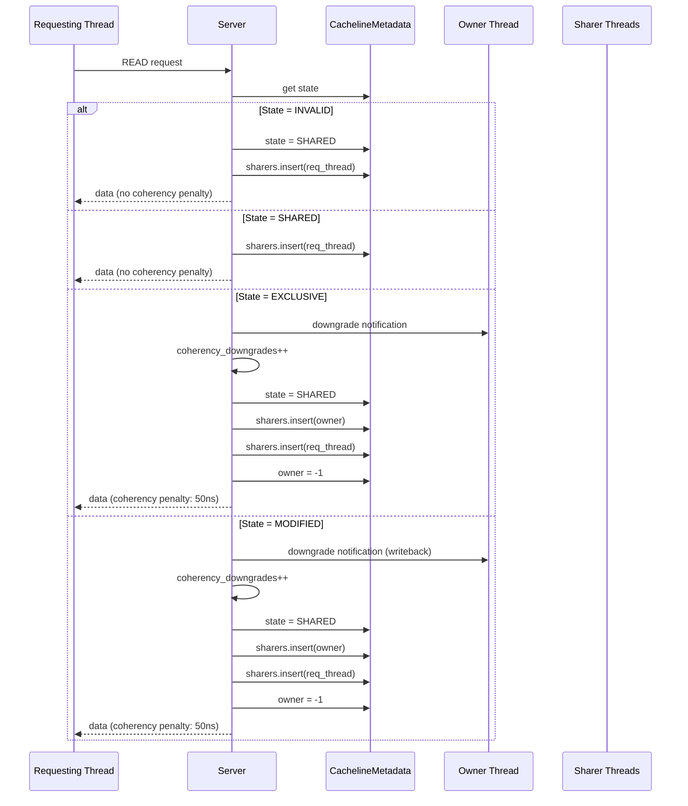
```mermaid
sequenceDiagram
    participant Req as Requesting Thread
    participant Server
    participant Meta as CachelineMetadata
    participant Owner as Owner Thread
    participant Sharers as Sharer Threads

    Req->>Server: READ request
    Server->>Meta: get state
    
    alt State = INVALID
        Server->>Meta: state = SHARED
        Server->>Meta: sharers.insert(req_thread)
        Server-->>Req: data (no coherency penalty)
        
    else State = SHARED
        Server->>Meta: sharers.insert(req_thread)
        Server-->>Req: data (no coherency penalty)
        
    else State = EXCLUSIVE
        Server->>Owner: downgrade notification
        Server->>Server: coherency_downgrades++
        Server->>Meta: state = SHARED
        Server->>Meta: sharers.insert(owner)
        Server->>Meta: sharers.insert(req_thread)
        Server->>Meta: owner = -1
        Server-->>Req: data (coherency penalty: 50ns)
        
    else State = MODIFIED
        Server->>Owner: downgrade notification (writeback)
        Server->>Server: coherency_downgrades++
        Server->>Meta: state = SHARED
        Server->>Meta: sharers.insert(owner)
        Server->>Meta: sharers.insert(req_thread)
        Server->>Meta: owner = -1
        Server-->>Req: data (coherency penalty: 50ns)
    end
```

### 3.2 Write Coherency State Transitions

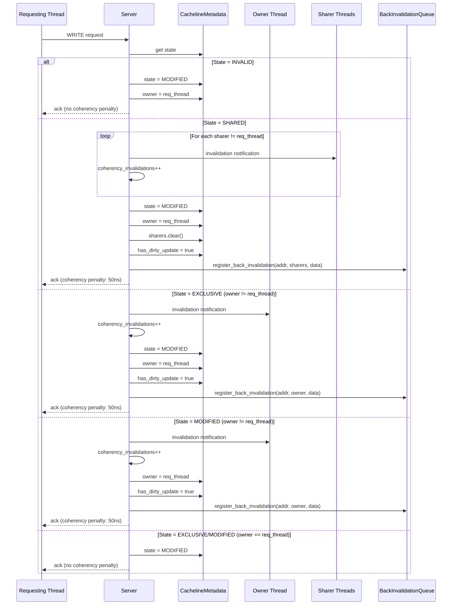
```mermaid
sequenceDiagram
    participant Req as Requesting Thread
    participant Server
    participant Meta as CachelineMetadata
    participant Owner as Owner Thread
    participant Sharers as Sharer Threads
    participant BackInv as BackInvalidationQueue

    Req->>Server: WRITE request
    Server->>Meta: get state
    
    alt State = INVALID
        Server->>Meta: state = MODIFIED
        Server->>Meta: owner = req_thread
        Server-->>Req: ack (no coherency penalty)
        
    else State = SHARED
        loop For each sharer != req_thread
            Server->>Sharers: invalidation notification
            Server->>Server: coherency_invalidations++
        end
        Server->>Meta: state = MODIFIED
        Server->>Meta: owner = req_thread
        Server->>Meta: sharers.clear()
        Server->>Meta: has_dirty_update = true
        Server->>BackInv: register_back_invalidation(addr, sharers, data)
        Server-->>Req: ack (coherency penalty: 50ns)
        
    else State = EXCLUSIVE (owner != req_thread)
        Server->>Owner: invalidation notification
        Server->>Server: coherency_invalidations++
        Server->>Meta: state = MODIFIED
        Server->>Meta: owner = req_thread
        Server->>Meta: has_dirty_update = true
        Server->>BackInv: register_back_invalidation(addr, owner, data)
        Server-->>Req: ack (coherency penalty: 50ns)
        
    else State = MODIFIED (owner != req_thread)
        Server->>Owner: invalidation notification
        Server->>Server: coherency_invalidations++
        Server->>Meta: owner = req_thread
        Server->>Meta: has_dirty_update = true
        Server->>BackInv: register_back_invalidation(addr, owner, data)
        Server-->>Req: ack (coherency penalty: 50ns)
        
    else State = EXCLUSIVE/MODIFIED (owner == req_thread)
        Server->>Meta: state = MODIFIED
        Server-->>Req: ack (no coherency penalty)
    end
```

### 3.3 Back Invalidation Flow

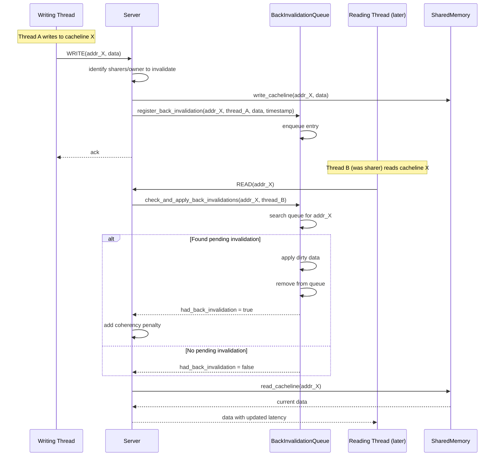
```mermaid
sequenceDiagram
    participant Writer as Writing Thread
    participant Server
    participant BackInv as BackInvalidationQueue
    participant Reader as Reading Thread (later)
    participant SHM as SharedMemory

    Note over Writer: Thread A writes to cacheline X
    
    Writer->>Server: WRITE(addr_X, data)
    Server->>Server: identify sharers/owner to invalidate
    Server->>SHM: write_cacheline(addr_X, data)
    Server->>BackInv: register_back_invalidation(addr_X, thread_A, data, timestamp)
    BackInv->>BackInv: enqueue entry
    Server-->>Writer: ack
    
    Note over Reader: Thread B (was sharer) reads cacheline X
    
    Reader->>Server: READ(addr_X)
    Server->>BackInv: check_and_apply_back_invalidations(addr_X, thread_B)
    
    BackInv->>BackInv: search queue for addr_X
    
    alt Found pending invalidation
        BackInv->>BackInv: apply dirty data
        BackInv->>BackInv: remove from queue
        BackInv-->>Server: had_back_invalidation = true
        Server->>Server: add coherency penalty
    else No pending invalidation
        BackInv-->>Server: had_back_invalidation = false
    end
    
    Server->>SHM: read_cacheline(addr_X)
    SHM-->>Server: current data
    Server-->>Reader: data with updated latency
```

---

## 4. Data Migration

### 4.1 Heat-Aware Migration

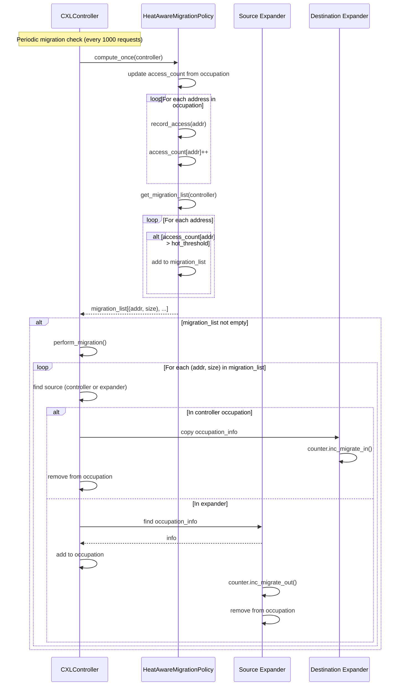
```mermaid
sequenceDiagram
    participant Ctrl as CXLController
    participant Policy as HeatAwareMigrationPolicy
    participant SrcExp as Source Expander
    participant DstExp as Destination Expander

    Note over Ctrl: Periodic migration check (every 1000 requests)
    
    Ctrl->>Policy: compute_once(controller)
    
    Policy->>Policy: update access_count from occupation
    
    loop For each address in occupation
        Policy->>Policy: record_access(addr)
        Policy->>Policy: access_count[addr]++
    end
    
    Policy->>Policy: get_migration_list(controller)
    
    loop For each address
        alt access_count[addr] > hot_threshold
            Policy->>Policy: add to migration_list
        end
    end
    
    Policy-->>Ctrl: migration_list[(addr, size), ...]
    
    alt migration_list not empty
        Ctrl->>Ctrl: perform_migration()
        
        loop For each (addr, size) in migration_list
            Ctrl->>Ctrl: find source (controller or expander)
            
            alt In controller occupation
                Ctrl->>DstExp: copy occupation_info
                DstExp->>DstExp: counter.inc_migrate_in()
                Ctrl->>Ctrl: remove from occupation
            else In expander
                Ctrl->>SrcExp: find occupation_info
                SrcExp-->>Ctrl: info
                Ctrl->>Ctrl: add to occupation
                SrcExp->>SrcExp: counter.inc_migrate_out()
                SrcExp->>SrcExp: remove from occupation
            end
        end
    end
```

### 4.2 Load Balancing Migration

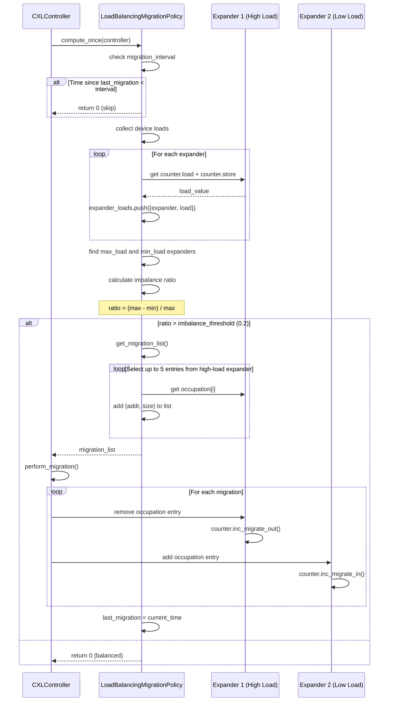
```mermaid
sequenceDiagram
    participant Ctrl as CXLController
    participant Policy as LoadBalancingMigrationPolicy
    participant Exp1 as Expander 1 (High Load)
    participant Exp2 as Expander 2 (Low Load)

    Ctrl->>Policy: compute_once(controller)
    
    Policy->>Policy: check migration_interval
    
    alt Time since last_migration < interval
        Policy-->>Ctrl: return 0 (skip)
    end
    
    Policy->>Policy: collect device loads
    
    loop For each expander
        Policy->>Exp1: get counter.load + counter.store
        Exp1-->>Policy: load_value
        Policy->>Policy: expander_loads.push({expander, load})
    end
    
    Policy->>Policy: find max_load and min_load expanders
    
    Policy->>Policy: calculate imbalance ratio
    Note over Policy: ratio = (max - min) / max
    
    alt ratio > imbalance_threshold (0.2)
        Policy->>Policy: get_migration_list()
        
        loop Select up to 5 entries from high-load expander
            Policy->>Exp1: get occupation[i]
            Policy->>Policy: add (addr, size) to list
        end
        
        Policy-->>Ctrl: migration_list
        
        Ctrl->>Ctrl: perform_migration()
        
        loop For each migration
            Ctrl->>Exp1: remove occupation entry
            Exp1->>Exp1: counter.inc_migrate_out()
            Ctrl->>Exp2: add occupation entry
            Exp2->>Exp2: counter.inc_migrate_in()
        end
        
        Policy->>Policy: last_migration = current_time
    else
        Policy-->>Ctrl: return 0 (balanced)
    end
```

---

## 5. Multi-Host Scenarios

### 5.1 Two-Host Memory Sharing

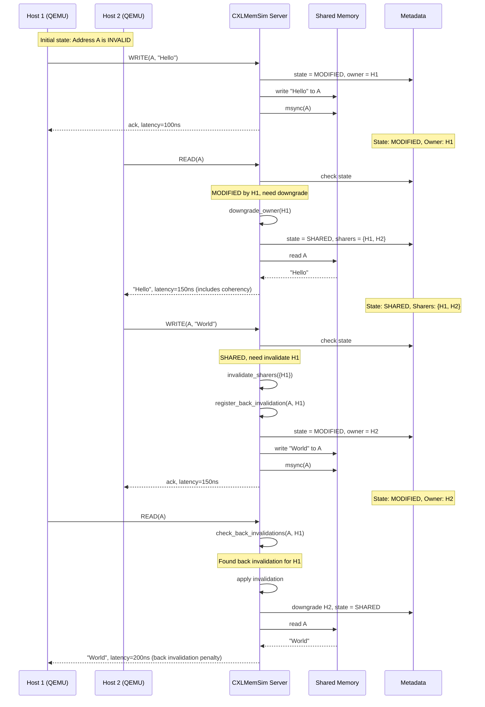
```mermaid
sequenceDiagram
    participant H1 as Host 1 (QEMU)
    participant H2 as Host 2 (QEMU)
    participant Server as CXLMemSim Server
    participant SHM as Shared Memory
    participant Meta as Metadata

    Note over H1,H2: Initial state: Address A is INVALID
    
    H1->>Server: WRITE(A, "Hello")
    Server->>Meta: state = MODIFIED, owner = H1
    Server->>SHM: write "Hello" to A
    Server->>SHM: msync(A)
    Server-->>H1: ack, latency=100ns
    
    Note over Meta: State: MODIFIED, Owner: H1
    
    H2->>Server: READ(A)
    Server->>Meta: check state
    Note over Server: MODIFIED by H1, need downgrade
    Server->>Server: downgrade_owner(H1)
    Server->>Meta: state = SHARED, sharers = {H1, H2}
    Server->>SHM: read A
    SHM-->>Server: "Hello"
    Server-->>H2: "Hello", latency=150ns (includes coherency)
    
    Note over Meta: State: SHARED, Sharers: {H1, H2}
    
    H2->>Server: WRITE(A, "World")
    Server->>Meta: check state
    Note over Server: SHARED, need invalidate H1
    Server->>Server: invalidate_sharers({H1})
    Server->>Server: register_back_invalidation(A, H1)
    Server->>Meta: state = MODIFIED, owner = H2
    Server->>SHM: write "World" to A
    Server->>SHM: msync(A)
    Server-->>H2: ack, latency=150ns
    
    Note over Meta: State: MODIFIED, Owner: H2
    
    H1->>Server: READ(A)
    Server->>Server: check_back_invalidations(A, H1)
    Note over Server: Found back invalidation for H1
    Server->>Server: apply invalidation
    Server->>Meta: downgrade H2, state = SHARED
    Server->>SHM: read A
    SHM-->>Server: "World"
    Server-->>H1: "World", latency=200ns (back invalidation penalty)
```

### 5.2 Concurrent Access Pattern

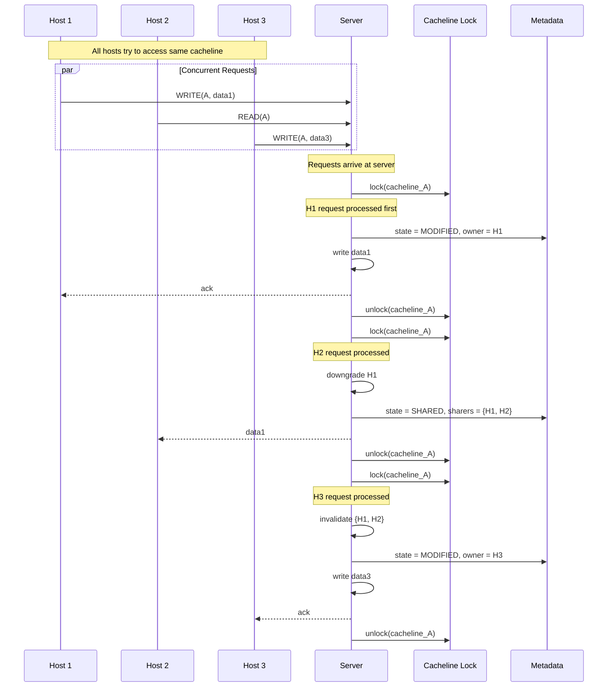
```mermaid
sequenceDiagram
    participant H1 as Host 1
    participant H2 as Host 2
    participant H3 as Host 3
    participant Server
    participant Lock as Cacheline Lock
    participant Meta as Metadata

    Note over H1,H3: All hosts try to access same cacheline
    
    par Concurrent Requests
        H1->>Server: WRITE(A, data1)
        H2->>Server: READ(A)
        H3->>Server: WRITE(A, data3)
    end
    
    Note over Server: Requests arrive at server
    
    Server->>Lock: lock(cacheline_A)
    Note over Server: H1 request processed first
    
    Server->>Meta: state = MODIFIED, owner = H1
    Server->>Server: write data1
    Server-->>H1: ack
    
    Server->>Lock: unlock(cacheline_A)
    
    Server->>Lock: lock(cacheline_A)
    Note over Server: H2 request processed
    
    Server->>Server: downgrade H1
    Server->>Meta: state = SHARED, sharers = {H1, H2}
    Server-->>H2: data1
    
    Server->>Lock: unlock(cacheline_A)
    
    Server->>Lock: lock(cacheline_A)
    Note over Server: H3 request processed
    
    Server->>Server: invalidate {H1, H2}
    Server->>Meta: state = MODIFIED, owner = H3
    Server->>Server: write data3
    Server-->>H3: ack
    
    Server->>Lock: unlock(cacheline_A)
```

---

## 6. Communication Flows

### 6.1 TCP Communication

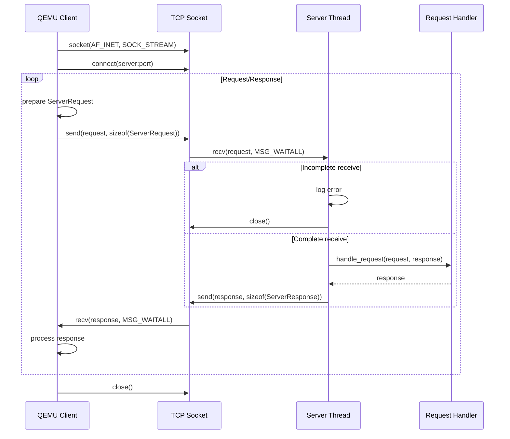
```mermaid
sequenceDiagram
    participant Client as QEMU Client
    participant Socket as TCP Socket
    participant Server as Server Thread
    participant Handler as Request Handler

    Client->>Socket: socket(AF_INET, SOCK_STREAM)
    Client->>Socket: connect(server:port)
    
    loop Request/Response
        Client->>Client: prepare ServerRequest
        Client->>Socket: send(request, sizeof(ServerRequest))
        
        Socket->>Server: recv(request, MSG_WAITALL)
        
        alt Incomplete receive
            Server->>Server: log error
            Server->>Socket: close()
        else Complete receive
            Server->>Handler: handle_request(request, response)
            Handler-->>Server: response
            Server->>Socket: send(response, sizeof(ServerResponse))
        end
        
        Socket->>Client: recv(response, MSG_WAITALL)
        Client->>Client: process response
    end
    
    Client->>Socket: close()
```

### 6.2 Shared Memory Communication

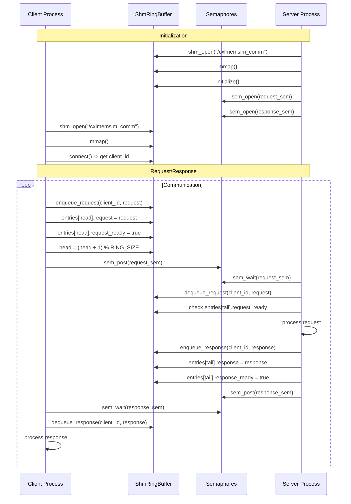
```mermaid
sequenceDiagram
    participant Client as Client Process
    participant Ring as ShmRingBuffer
    participant Sem as Semaphores
    participant Server as Server Process

    Note over Client,Server: Initialization
    
    Server->>Ring: shm_open("/cxlmemsim_comm")
    Server->>Ring: mmap()
    Server->>Ring: initialize()
    Server->>Sem: sem_open(request_sem)
    Server->>Sem: sem_open(response_sem)
    
    Client->>Ring: shm_open("/cxlmemsim_comm")
    Client->>Ring: mmap()
    Client->>Ring: connect() -> get client_id
    
    Note over Client,Server: Request/Response
    
    loop Communication
        Client->>Ring: enqueue_request(client_id, request)
        Client->>Ring: entries[head].request = request
        Client->>Ring: entries[head].request_ready = true
        Client->>Ring: head = (head + 1) % RING_SIZE
        Client->>Sem: sem_post(request_sem)
        
        Server->>Sem: sem_wait(request_sem)
        Server->>Ring: dequeue_request(client_id, request)
        Server->>Ring: check entries[tail].request_ready
        Server->>Server: process request
        
        Server->>Ring: enqueue_response(client_id, response)
        Server->>Ring: entries[tail].response = response
        Server->>Ring: entries[tail].response_ready = true
        Server->>Sem: sem_post(response_sem)
        
        Client->>Sem: sem_wait(response_sem)
        Client->>Ring: dequeue_response(client_id, response)
        Client->>Client: process response
    end
```

### 6.3 RDMA Communication

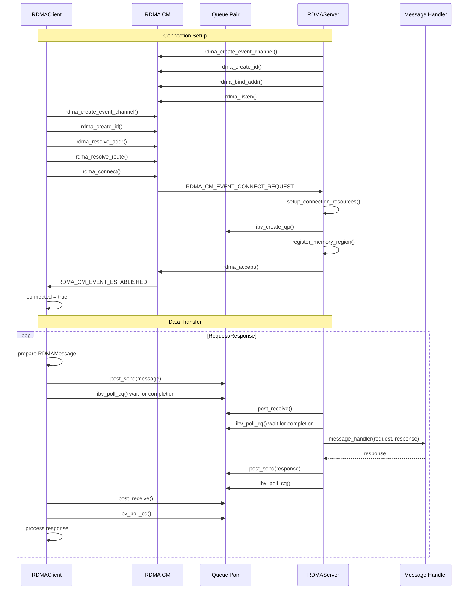
```mermaid
sequenceDiagram
    participant Client as RDMAClient
    participant CM as RDMA CM
    participant QP as Queue Pair
    participant Server as RDMAServer
    participant Handler as Message Handler

    Note over Client,Server: Connection Setup
    
    Server->>CM: rdma_create_event_channel()
    Server->>CM: rdma_create_id()
    Server->>CM: rdma_bind_addr()
    Server->>CM: rdma_listen()
    
    Client->>CM: rdma_create_event_channel()
    Client->>CM: rdma_create_id()
    Client->>CM: rdma_resolve_addr()
    Client->>CM: rdma_resolve_route()
    
    Client->>CM: rdma_connect()
    CM->>Server: RDMA_CM_EVENT_CONNECT_REQUEST
    
    Server->>Server: setup_connection_resources()
    Server->>QP: ibv_create_qp()
    Server->>Server: register_memory_region()
    Server->>CM: rdma_accept()
    
    CM->>Client: RDMA_CM_EVENT_ESTABLISHED
    Client->>Client: connected = true
    
    Note over Client,Server: Data Transfer
    
    loop Request/Response
        Client->>Client: prepare RDMAMessage
        Client->>QP: post_send(message)
        Client->>QP: ibv_poll_cq() wait for completion
        
        Server->>QP: post_receive()
        Server->>QP: ibv_poll_cq() wait for completion
        Server->>Handler: message_handler(request, response)
        Handler-->>Server: response
        
        Server->>QP: post_send(response)
        Server->>QP: ibv_poll_cq()
        
        Client->>QP: post_receive()
        Client->>QP: ibv_poll_cq()
        Client->>Client: process response
    end
```

---

## Appendix: State Diagrams

### A.1 Coherency State Machine

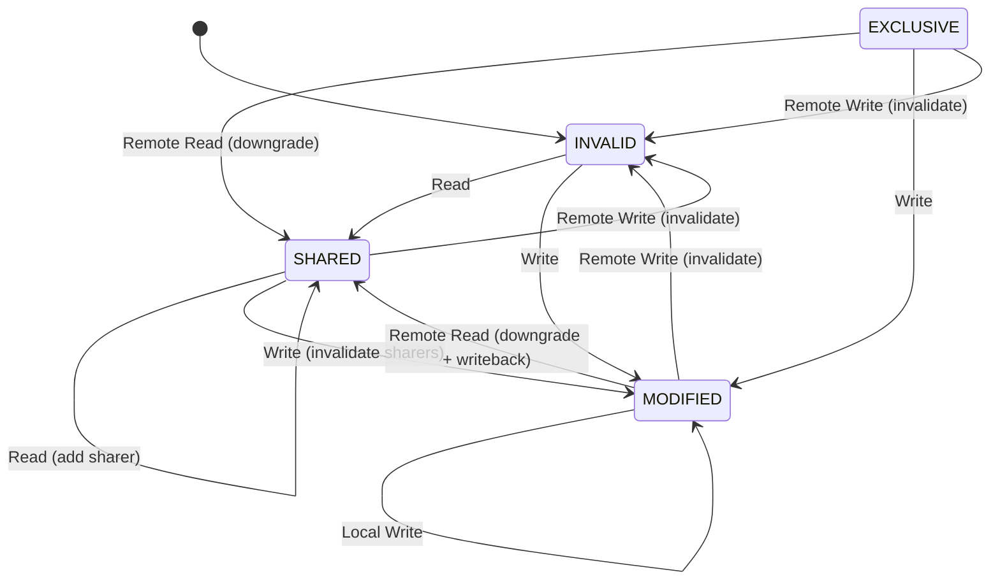
```mermaid
stateDiagram-v2
    [*] --> INVALID
    
    INVALID --> SHARED: Read
    INVALID --> MODIFIED: Write
    
    SHARED --> SHARED: Read (add sharer)
    SHARED --> MODIFIED: Write (invalidate sharers)
    
    EXCLUSIVE --> SHARED: Remote Read (downgrade)
    EXCLUSIVE --> MODIFIED: Write
    
    MODIFIED --> SHARED: Remote Read (downgrade + writeback)
    MODIFIED --> MODIFIED: Local Write
    MODIFIED --> INVALID: Remote Write (invalidate)
    
    SHARED --> INVALID: Remote Write (invalidate)
    EXCLUSIVE --> INVALID: Remote Write (invalidate)
```

### A.2 Server Thread States

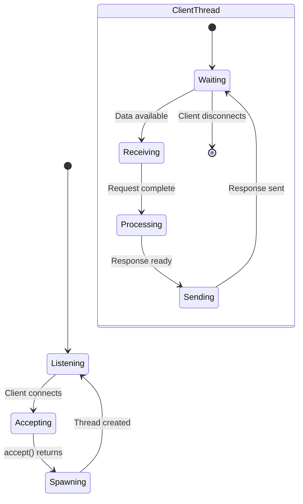
```mermaid
stateDiagram-v2
    [*] --> Listening
    
    Listening --> Accepting: Client connects
    Accepting --> Spawning: accept() returns
    Spawning --> Listening: Thread created
    
    state ClientThread {
        [*] --> Waiting
        Waiting --> Receiving: Data available
        Receiving --> Processing: Request complete
        Processing --> Sending: Response ready
        Sending --> Waiting: Response sent
        Waiting --> [*]: Client disconnects
    }
```

### A.3 Request Queue States

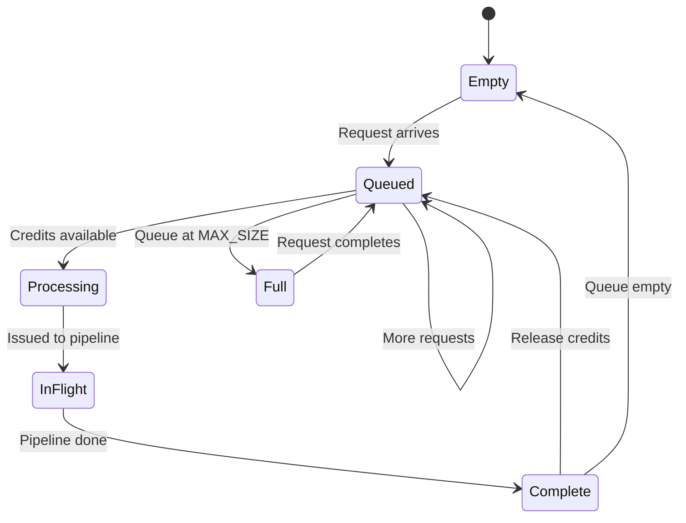
```mermaid
stateDiagram-v2
    [*] --> Empty
    
    Empty --> Queued: Request arrives
    Queued --> Queued: More requests
    Queued --> Processing: Credits available
    Processing --> InFlight: Issued to pipeline
    InFlight --> Complete: Pipeline done
    Complete --> Queued: Release credits
    Complete --> Empty: Queue empty
    
    Queued --> Full: Queue at MAX_SIZE
    Full --> Queued: Request completes
```

---

*Sequence diagrams for OCEAN CXL Emulation Framework*  
*Use Mermaid-compatible viewers to render these diagrams*
