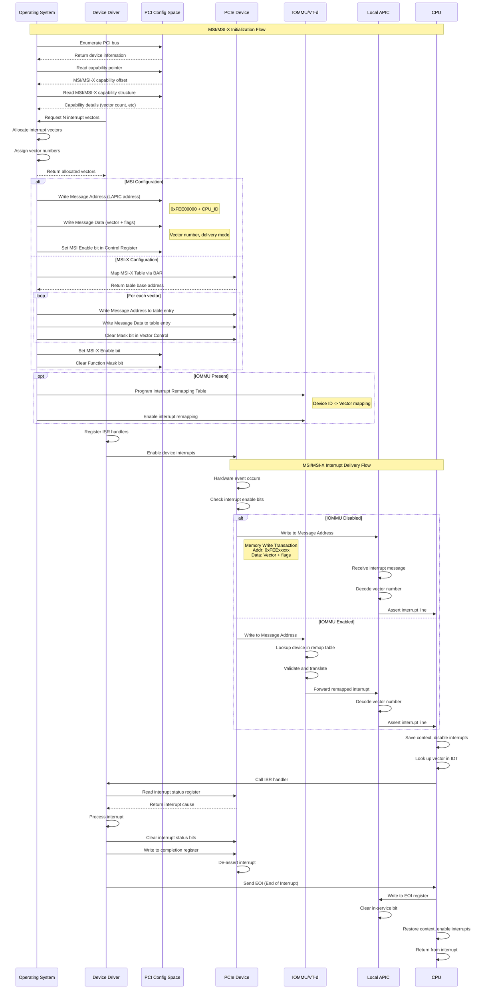

```mermaid
sequenceDiagram
    participant OS as Operating System
    participant Driver as Device Driver
    participant PCI as PCI Config Space
    participant Device as PCIe Device
    participant IOMMU as IOMMU/VT-d
    participant LAPIC as Local APIC
    participant CPU

    Note over OS,CPU: MSI/MSI-X Initialization Flow
    
    OS->>PCI: Enumerate PCI bus
    PCI-->>OS: Return device information
    
    OS->>PCI: Read capability pointer
    PCI-->>OS: MSI/MSI-X capability offset
    
    OS->>PCI: Read MSI/MSI-X capability structure
    PCI-->>OS: Capability details (vector count, etc)
    
    Driver->>OS: Request N interrupt vectors
    OS->>OS: Allocate interrupt vectors
    OS->>OS: Assign vector numbers
    OS-->>Driver: Return allocated vectors
    
    alt MSI Configuration
        OS->>PCI: Write Message Address (LAPIC address)
        Note right of PCI: 0xFEE00000 + CPU_ID
        OS->>PCI: Write Message Data (vector + flags)
        Note right of PCI: Vector number, delivery mode
        OS->>PCI: Set MSI Enable bit in Control Register
    else MSI-X Configuration
        OS->>Device: Map MSI-X Table via BAR
        Device-->>OS: Return table base address
        loop For each vector
            OS->>Device: Write Message Address to table entry
            OS->>Device: Write Message Data to table entry
            OS->>Device: Clear Mask bit in Vector Control
        end
        OS->>PCI: Set MSI-X Enable bit
        OS->>PCI: Clear Function Mask bit
    end
    
    opt IOMMU Present
        OS->>IOMMU: Program Interrupt Remapping Table
        Note right of IOMMU: Device ID -> Vector mapping
        OS->>IOMMU: Enable interrupt remapping
    end
    
    Driver->>Driver: Register ISR handlers
    Driver->>Device: Enable device interrupts
    
    Note over Device,CPU: MSI/MSI-X Interrupt Delivery Flow
    
    Device->>Device: Hardware event occurs
    Device->>Device: Check interrupt enable bits
    
    alt IOMMU Disabled
        Device->>LAPIC: Write to Message Address
        Note right of Device: Memory Write Transaction<br/>Addr: 0xFEExxxxx<br/>Data: Vector + flags
        LAPIC->>LAPIC: Receive interrupt message
        LAPIC->>LAPIC: Decode vector number
        LAPIC->>CPU: Assert interrupt line
    else IOMMU Enabled
        Device->>IOMMU: Write to Message Address
        IOMMU->>IOMMU: Lookup device in remap table
        IOMMU->>IOMMU: Validate and translate
        IOMMU->>LAPIC: Forward remapped interrupt
        LAPIC->>LAPIC: Decode vector number
        LAPIC->>CPU: Assert interrupt line
    end
    
    CPU->>CPU: Save context, disable interrupts
    CPU->>CPU: Look up vector in IDT
    CPU->>Driver: Call ISR handler
    
    Driver->>Device: Read interrupt status register
    Device-->>Driver: Return interrupt cause
    
    Driver->>Driver: Process interrupt
    Driver->>Device: Clear interrupt status bits
    Driver->>Device: Write to completion register
    
    Device->>Device: De-assert interrupt
    
    Driver->>CPU: Send EOI (End of Interrupt)
    CPU->>LAPIC: Write to EOI register
    LAPIC->>LAPIC: Clear in-service bit
    
    CPU->>CPU: Restore context, enable interrupts
    CPU->>CPU: Return from interrupt
```
