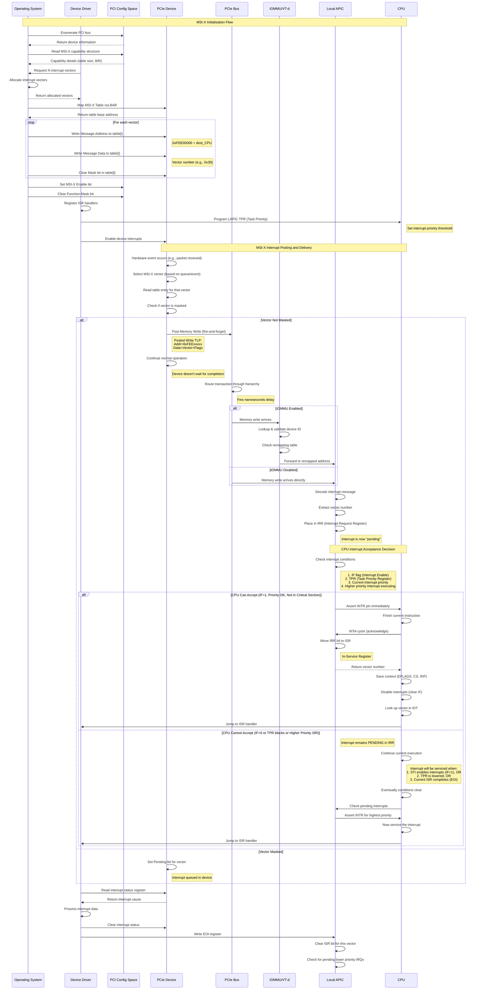

```mermaid
sequenceDiagram
    participant OS as Operating System
    participant Driver as Device Driver
    participant PCI as PCI Config Space
    participant Device as PCIe Device
    participant PCIe as PCIe Bus
    participant IOMMU as IOMMU/VT-d
    participant LAPIC as Local APIC
    participant CPU

    Note over OS,CPU: MSI-X Initialization Flow
    
    OS->>PCI: Enumerate PCI bus
    PCI-->>OS: Return device information
    
    OS->>PCI: Read MSI-X capability structure
    PCI-->>OS: Capability details (table size, BIR)
    
    Driver->>OS: Request N interrupt vectors
    OS->>OS: Allocate interrupt vectors
    OS-->>Driver: Return allocated vectors
    
    OS->>Device: Map MSI-X Table via BAR
    Device-->>OS: Return table base address
    
    loop For each vector
        OS->>Device: Write Message Address to table[i]
        Note right of Device: 0xFEE00000 + dest_CPU
        OS->>Device: Write Message Data to table[i]
        Note right of Device: Vector number (e.g., 0x30)
        OS->>Device: Clear Mask bit in table[i]
    end
    
    OS->>PCI: Set MSI-X Enable bit
    OS->>PCI: Clear Function Mask bit
    
    Driver->>Driver: Register ISR handlers
    Driver->>CPU: Program LAPIC TPR (Task Priority)
    Note right of CPU: Set interrupt priority threshold
    Driver->>Device: Enable device interrupts
    
    Note over Device,CPU: MSI-X Interrupt Posting and Delivery
    
    Device->>Device: Hardware event occurs (e.g., packet received)
    Device->>Device: Select MSI-X vector (based on queue/event)
    Device->>Device: Read table entry for that vector
    Device->>Device: Check if vector is masked
    
    alt Vector Not Masked
        Device->>PCIe: Post Memory Write (fire-and-forget)
        Note right of Device: Posted Write TLP:<br/>Addr=0xFEExxxxx<br/>Data=Vector+Flags
        Device->>Device: Continue normal operation
        Note right of Device: Device doesn't wait for completion
        
        PCIe->>PCIe: Route transaction through hierarchy
        Note right of PCIe: Few nanoseconds delay
        
        alt IOMMU Enabled
            PCIe->>IOMMU: Memory write arrives
            IOMMU->>IOMMU: Lookup & validate device ID
            IOMMU->>IOMMU: Check remapping table
            IOMMU->>LAPIC: Forward to remapped address
        else IOMMU Disabled
            PCIe->>LAPIC: Memory write arrives directly
        end
        
        LAPIC->>LAPIC: Decode interrupt message
        LAPIC->>LAPIC: Extract vector number
        LAPIC->>LAPIC: Place in IRR (Interrupt Request Register)
        Note right of LAPIC: Interrupt is now "pending"
        
        Note over LAPIC,CPU: CPU Interrupt Acceptance Decision
        
        LAPIC->>LAPIC: Check interrupt conditions
        Note right of LAPIC: 1. IF flag (Interrupt Enable)<br/>2. TPR (Task Priority Register)<br/>3. Current interrupt priority<br/>4. Higher priority interrupt executing
        
        alt CPU Can Accept (IF=1, Priority OK, Not in Critical Section)
            LAPIC->>CPU: Assert INTR pin immediately
            CPU->>CPU: Finish current instruction
            CPU->>LAPIC: INTA cycle (acknowledge)
            LAPIC->>LAPIC: Move IRR bit to ISR
            Note right of LAPIC: In-Service Register
            LAPIC-->>CPU: Return vector number
            CPU->>CPU: Save context (EFLAGS, CS, RIP)
            CPU->>CPU: Disable interrupts (clear IF)
            CPU->>CPU: Look up vector in IDT
            CPU->>Driver: Jump to ISR handler
        else CPU Cannot Accept (IF=0 or TPR blocks or Higher Priority ISR)
            Note right of LAPIC: Interrupt remains PENDING in IRR
            CPU->>CPU: Continue current execution
            Note right of CPU: Interrupt will be serviced when:<br/>1. STI enables interrupts (IF=1), OR<br/>2. TPR is lowered, OR<br/>3. Current ISR completes (EOI)
            
            CPU->>CPU: Eventually conditions clear
            CPU->>LAPIC: Check pending interrupts
            LAPIC->>CPU: Assert INTR for highest priority
            CPU->>CPU: Now service the interrupt
            CPU->>Driver: Jump to ISR handler
        end
    else Vector Masked
        Device->>Device: Set Pending bit for vector
        Note right of Device: Interrupt queued in device
    end
    
    Driver->>Device: Read interrupt status register
    Device-->>Driver: Return interrupt cause
    Driver->>Driver: Process interrupt data
    Driver->>Device: Clear interrupt status
    
    Driver->>LAPIC: Write EOI register
    LAPIC->>LAPIC: Clear ISR bit for this vector
    LAPIC->>LAPIC: Check for pending lower priority IRQs
```
    
    CPU->>CPU: IRET instruction
    CPU->>CPU: Restore context (EFLAGS, CS, RIP)
    Note right of CPU: IF flag restored, interrupts re-enabled
